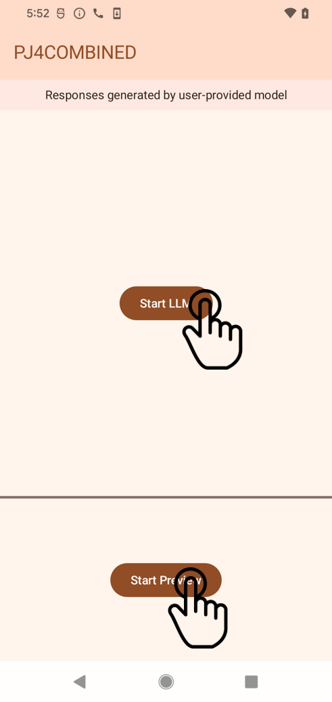

# Emerging Systems Lab: Multi-Agent AI on Mobile

Welcome to **Emerging Systems Lab**, a mini AI project demonstrating how to **run multiple AI models**—specifically **[Gemma 2][ref-gemma2]** (a lightweight Large Language Model) and **[EfficientDet][ref-efficientdet]** (an object detection model)—**simultaneously on a mobile device** while **optimizing performance**.

This work addresses the challenge that **mobile GPUs can only run one inference at a time**, leading to significant slowdowns or system crashes when large models saturate resources. Our solution leverages **dynamic CPU–GPU orchestration** to maintain responsiveness and prevent overloading the GPU.

---

## Table of Contents
1. [Overview](#overview)
2. [Motivation](#motivation)
3. [Key Features](#key-features)
4. [Project Architecture](#project-architecture)
5. [Implementation Details](#implementation-details)
6. [Performance Results](#performance-results)
7. [Limitations & Future Enhancements](#limitations--future-enhancements)
8. [Setup & Usage](#setup--usage)
9. [Screenshots](#screenshots)
10. [References](#references)

---

## Overview

**Emerging Systems Lab** is developed as part of a course project aiming to showcase real-time **multi-model inference** on a smartphone. The app runs:

- A **[Gemma 2][ref-gemma2]** Large Language Model (LLM) for chatbot functionality.
- An **[EfficientDet][ref-efficientdet]** model for object detection from the device camera.

**Objective**: To demonstrate how to **balance CPU and GPU workloads** when running these models in parallel, thereby preventing crashes and ensuring reasonable inference speeds.

---

## Motivation

1. **Mobile GPU Limitations**: Most mobile GPUs can handle only one high-load inference task at a time. Running multiple tasks concurrently causes significant latency or system instability.
2. **Need for On-Device AI**: Users require advanced AI (e.g., GPT-like chatbots) in environments without reliable internet connectivity (e.g., on flights or in remote regions).
3. **Resource Management**: Excessive resource usage by a single model can degrade performance across the entire system. Our approach ensures **smooth, multi-agent AI** operation on resource-constrained devices.

---

## Key Features

- **Concurrent AI Agents**:
  - **[Gemma 2][ref-gemma2]** for on-device chatbot functionalities.
  - **[EfficientDet][ref-efficientdet]** for object detection in real-time via the device camera.

- **Dynamic CPU–GPU Orchestration**:
  - Real-time **threshold-based switching** to offload tasks from GPU to CPU when GPU is overloaded.
  - **Adaptive** model loading and unloading to **prevent crashes** and ensure stable FPS (frames per second).

- **Scalability**:
  - Extensible framework where additional AI agents (e.g., voice activity detection, health monitoring) can be plugged in.

---

## Project Architecture

```plaintext
          ┌───────────────────┐
          │   Mobile Device   │
          │ (Android Phone)   │
          └───────────────────┘
                   │
                   ▼
   ┌───────────────────────────────────┐
   │        Camera Input Stream        │
   └───────────────────────────────────┘
                   │
                   ▼
   ┌───────────────────────────────────┐
   │     EfficientDet (Object Det.)    │
   │   [Runs on GPU by Default]        │
   └───────────────────────────────────┘
                   │
                   ▼
        ┌─────────────────┐
        │ Inference Time? │
        └─────────────────┘
                   │
       ┌───────────┴────────────┐
       ▼                        ▼
[If Overloaded]            [Else Continue]
Switch to CPU                    │
       ┌───────────┐             │
       │ CPU Model │             │
       └───────────┘             │
                   ▼
      ┌────────────────────┐
      │ Detection Results  │
      └────────────────────┘

   ┌───────────────────────────────────┐
   │          Gemma 2 (LLM)            │
   │   [Runs on GPU by Default]        │
   └───────────────────────────────────┘
                   │
                   ▼
           ┌────────────────┐
           │ User Interface │
           └────────────────┘
```

1. Camera Input feeds into the EfficientDet model.
2. Gemma 2 processes textual queries and operates concurrently.
3. Inference Time Monitor triggers a switch to CPU if GPU usage is too high.
4. Results are displayed to the user.

## Implementation Details

## Dynamic Processing Unit Switching

#### Threshold-Based Approach
If the inference time for the object detection model exceeds a set threshold (e.g., **70 ms**), the system initializes a **CPU version** of the model and re-routes future inferences to the CPU.

#### Code Snippet (Kotlin)
```kotlin
if (detectionResults.value != null) { 
    val inferenceTimeThreshold = 70L // ms
    
    if (detectionResults.value!!.inferenceTime > inferenceTimeThreshold) { 
        Log.d("CS330", "GPU too slow, switching to CPU start") 

        val cpuClassifier = PersonClassifier()
        cpuClassifier.initialize(
            context,
            threadNumber = 2,
            useGPU = false
        )
        cpuClassifier.setDetectorListener(listener)

        imageAnalyzer.clearAnalyzer()
        imageAnalyzer.setAnalyzer(cameraExecutor) { image ->
            detectObjects(image, cpuClassifier)
            image.close()
        }

        Log.d("CS330", "GPU too slow, switching to CPU done")
    }
}
```
- A CPU-based classifier is pre-initialized or loaded dynamically.
- Once the inference threshold is surpassed, the system unloads the GPU model and switches to CPU-based inference.
- This mechanism helps to:
- Prevent GPU saturation
- Avoid phone freezes or crashes

## Performance Results

#### Object Detection (GPU Only)
- **Typical inference time:** < 60 ms (smooth performance).

#### Object Detection + LLM (Concurrent on GPU)
- **Inference time:** 200–400 ms (causes noticeable delays).

#### Switching Object Detection to CPU
- **Typical inference time:** 80–130 ms after switching, preventing system overload.

#### System Crashes
- **Observed** before implementing switching.
- **Greatly reduced** with dynamic switching in place.

#### Device Specifications
- **Chipset:** Qualcomm SM8550-AC Snapdragon 8 Gen 2 (4 nm)
- **CPU:** Octa-core  
  - 1 × 3.36 GHz Cortex-X3  
  - 2 × 2.8 GHz Cortex-A715  
  - 2 × 2.8 GHz Cortex-A710  
  - 3 × 2.0 GHz Cortex-A510  
- **GPU:** Adreno 740

## Setup & Usage

#### Prerequisites
- **Android Studio** (latest version recommended).
- A **physical Android device** running **Android 13 or later** (tested on **Samsung Galaxy S23 Ultra**).
- **Git** for cloning the repository.

#### Steps to Run

#### Clone the Repository
```bash
git clone https://github.com/uziahmd/Emerging-Systems.git
cd Emerging-Systems
```

#### Open in Android Studio
- Go to File → Open... and select the Emerging-Systems folder.

#### Build & Deploy
- Connect your Android device via USB.
- Click Run (▶) in Android Studio to deploy the app onto your device.

#### Usage
- Start the App on your device.
- EfficientDet initializes automatically (on GPU by default).
- Gemma 2 LLM can be accessed through the chat interface (menu option).
- Monitor console logs (Logcat) to see if/when the CPU fallback is triggered.

## Screenshots

Below are two images demonstrating the app’s functionality:

#### App Start Screen
*Waiting for the user to run the models.*

<p align="center">
  
</p>

#### Model Running
*Both Object Detection and Gemma 2 active, demonstrating the system’s dynamic switching.*

<p align="center">
  
</p>


## References

- **EfficientDet**:  
  Tan, M., Pang, R., & Le, Q. V. (2020). *EfficientDet: Scalable and Efficient Object Detection.*  
  In *Proceedings of the IEEE/CVF Conference on Computer Vision and Pattern Recognition* (pp. 10781-10790).  
  [Paper Link](https://openaccess.thecvf.com/content_CVPR_2020/html/Tan_EfficientDet_Scalable_and_Efficient_Object_Detection_CVPR_2020_paper.html)

- **Gemma 2**:  
  Gemma Team et al. (2024). *Gemma 2: Improving Open Language Models at a Practical Size.*  
  *arXiv preprint arXiv:2408.00118.*  
  [Paper Link](https://arxiv.org/abs/2408.00118)
